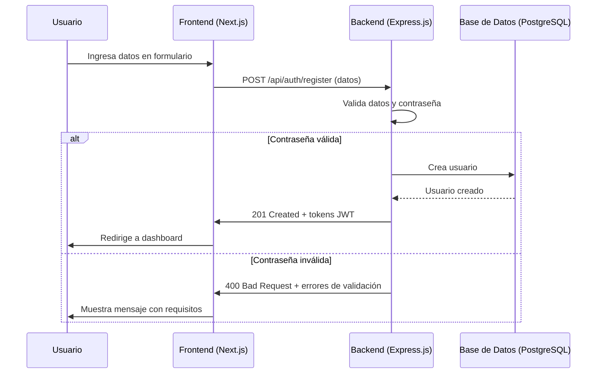

# Diagramas del Proyecto Open URL Shortener

## Diagrama de Arquitectura General

```mermaid
graph TD
    subgraph Frontend (Next.js)
        FE["Registro de usuario<br/>Formulario de registro"]
        FE -->|POST /api/auth/register| BE
    end
    subgraph Backend (Express.js)
        BE["API REST<br/>Validación de usuario y contraseña"]
        BE -->|Valida contraseña y datos| DB[(PostgreSQL)]
        BE -->|Tokens JWT| FE
        BE -->|CORS| FE
    end
    subgraph Infraestructura
        DB[(PostgreSQL)]
        REDIS[(Redis)]
        BE --> REDIS
    end
```

## Diagrama de Flujo: Registro de Usuario



## Notas
- La validación de contraseña se realiza en el backend y los requisitos se muestran en el frontend.
- El frontend maneja y muestra mensajes de error específicos según la respuesta del backend.
- El backend utiliza JWT para autenticación y Redis para cache.
